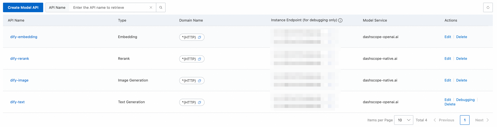
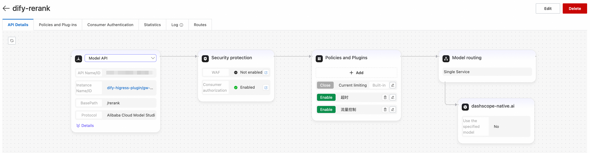
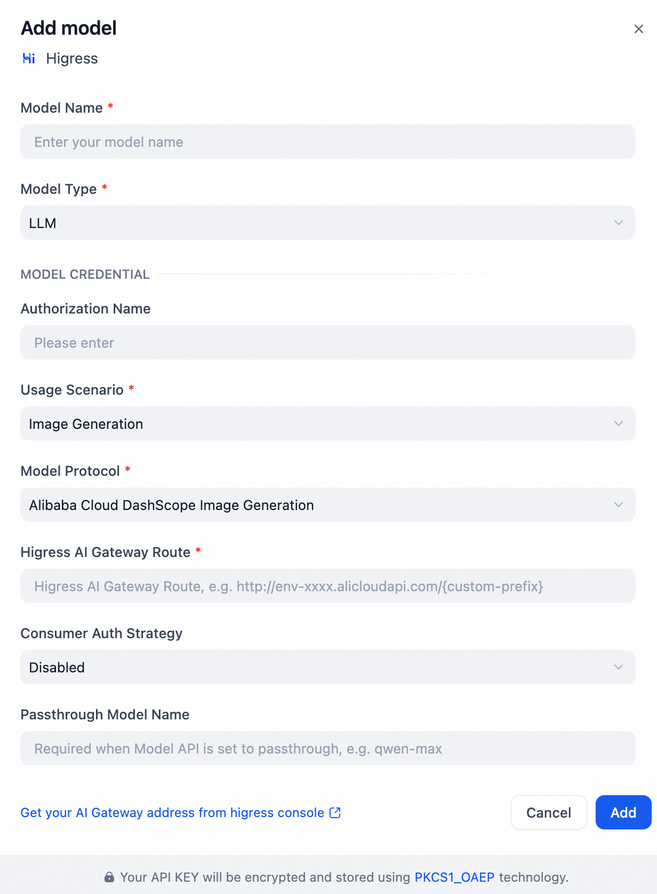

## Dify Higress Model Plugin

**Author:** higress
**Version:** 0.0.7
**Type:** model

### Introduction

This plugin enables Dify to access model services through the **Model API of the Higress AI Gateway**. The Higress AI Gateway can proxy a wide range of model providers (cloud vendors/platforms) as well as self-hosted model inference services, and provides AI-traffic-oriented governance, observability, security authentication, and more. With this plugin on the Dify side, you only need to configure the gateway route URL, protocol, and authentication method to use different model capabilities as needed.

This plugin supports both the **open-source self-host Higress** and the commercial **Alibaba Cloud Cloud-Native AI Gateway**.

### Features

- **Text Generation (LLM)**: OpenAI-compatible protocol, supports chat and completion modes
- **Image Generation**: Alibaba Cloud DashScope image generation protocol
- **Text Embedding**: OpenAI-compatible protocol
- **Text Reranking**: Alibaba Cloud DashScope rerank protocol
- **Function Calling / Tool Call**: Configurable function calling or tool calling support
- **Thinking Mode**: Supports reasoning models (e.g., Qwen3) with configurable thinking mode (on/off/both), and handles streaming reasoning returned via either `reasoning_content` or `reasoning`
- **Reasoning Effort**: Constrains the effort level for reasoning models (low/medium/high)
- **Multimodal Input**: Supports image, video, audio, and document input for vision-language models (e.g., Qwen-VL series)
- **Web Search**: Activates AI Gateway web search feature for text generation (requires gateway-side configuration)
- **Structured Output**: Supports JSON schema output format and reasoning format configuration
- **Consumer Authentication**: Supports API Key and AK/SK (HMAC) authentication strategies
- **Passthrough Model Name**: Supports dynamic model routing via the gateway

### Setup

1. In the Higress AI Gateway console, create Model APIs for different use cases and protocols. Configure policies as needed, such as traffic protection, consumer authentication, observability and statistics, and plugins, to centrally govern and operate AI traffic.

2. After installing this plugin in Dify, go to **Settings / Model Provider**, select **Higress**, and click **Add Model**.
3. Fill in the plugin configuration fields. Key fields include:
   
   - **Usage Scenario**: The intended use case of the target Model API route. Supported options include text generation, image generation, text reranking, and text embedding.
   - **Model Protocol**: The protocol of the target Model API route, such as OpenAI-compatible or DashScope native protocol.
   - **Function Call Type**: Configure whether the model supports function calling (`Function Call`) or tool calling (`Tool Call`), or not at all.
   - **Thinking Mode Support**: Configure whether the model supports thinking mode, non-thinking mode, or both. This controls the availability of the thinking mode toggle.
   - **Multimodal Support**: Enable for vision-language models that support multimodal input (image, video, audio, document), e.g., Qwen-VL series.
   - **Higress AI Gateway Route**: The Model API route URL you want to access, in the format `{http/https}://{gateway-domain}/{custom-prefix}`.
   - **Consumer Auth Strategy**: Select **Disabled / API Key / AK/SK (HMAC)** based on the consumer-auth configuration for the Model API, and provide the corresponding credentials.
   - **Passthrough Model Name**: Required when the Model API is configured to pass through the model name, for example `qwen-max`.

4. When building a Dify app or knowledge base, select the Higress model configured above to let your Dify app access models via the Higress AI Gateway proxy.
